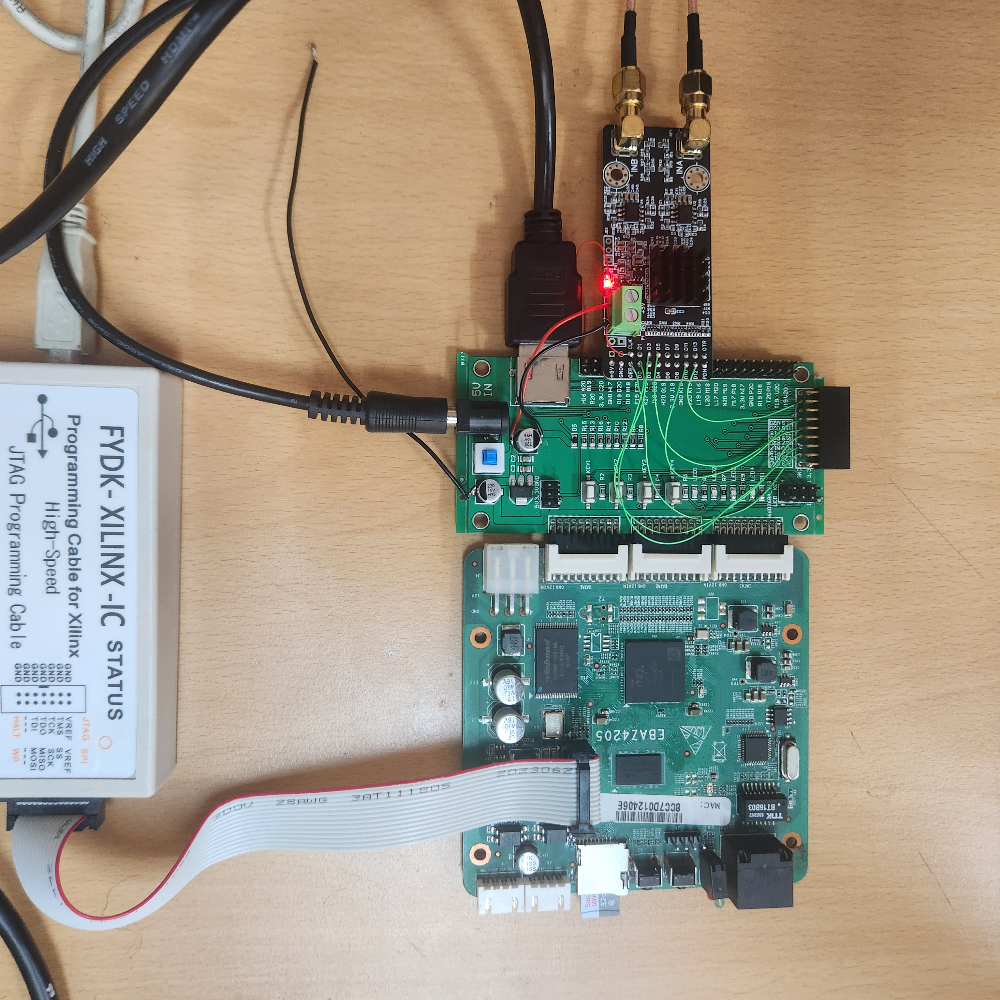
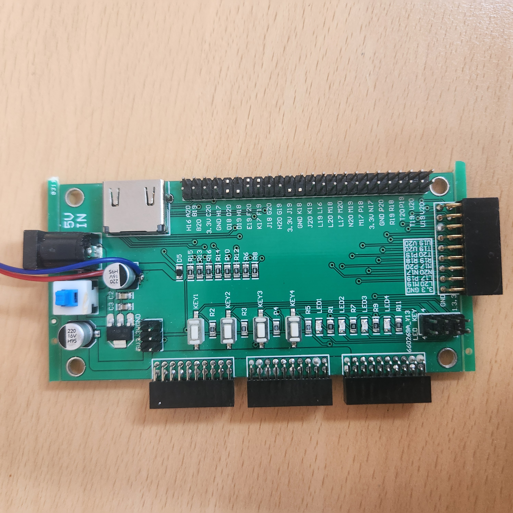
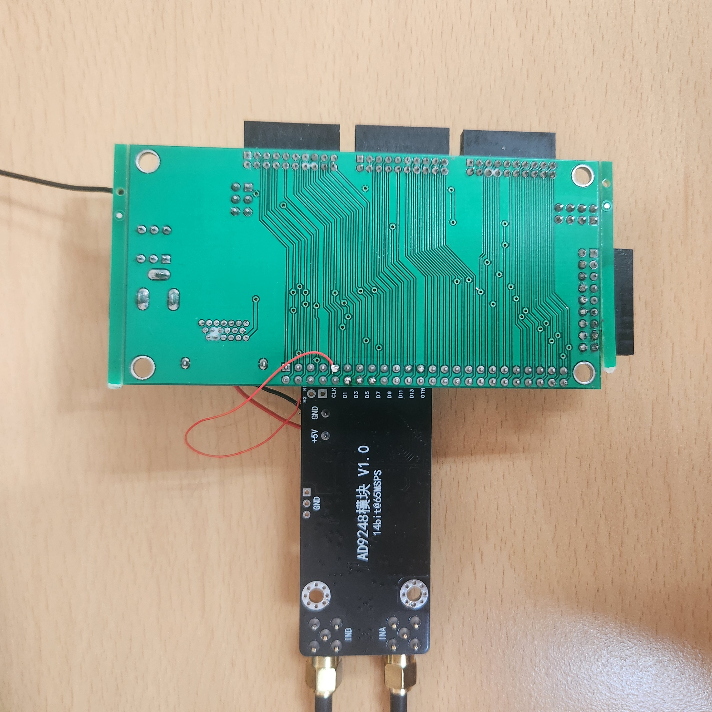

# NexEBAZ4205_AD9248_PS

EBAZ4205 + 660Z069A_V13 IO board + AD9248 (14-bit, 65MSPS) → ADC 캡처 + DDR3 버퍼 + HDMI 파형 표시

## 실습 환경

| 전체 구성 | IO보드 + AD9248 | 뒷면 배선 |
|-----------|----------------|----------|
|  |  |  |

- EBAZ4205(하단) + 660Z069A_V13 IO 보드(중간) + AD9248 V1.0 보드(상단) 스택 구성
- JTAG-XILINX 케이블로 FPGA 프로그래밍
- AD9248: SMA 커넥터(INA/INB)로 아날로그 입력, 14bit@65MSPS

## 아키텍처

```
[AD9248 SMA] → adc_data[13:0] → adc_capture
                                     │
                  ┌──────────────────┼────────────────────┐
                  │                  │                    │
                ILA              AXI HP0             HDMI render
              (디버그)         DMA → DDR3            (파형 표시)
                                     │
                               AXI HP1 ← PS ARM
                                     │
                               AXI-Lite ← PS (설정/제어)

ENCODE(50MHz) ← ODDR ← FCLK_CLK0
```

## 개발 단계

| 단계 | 내용 | 상태 |
|------|------|------|
| 1 | 기본 캡처 + ILA | ✅ 코드 완료, 테스트 대기 |
| 2 | AXI HP0 DMA → DDR3 | 예정 |
| 3 | HDMI 파형 표시 | 예정 |
| 4 | PS AXI-Lite 제어 | 예정 |

## 빌드 및 실행

```bash
# 빌드
cd /media/douglas/extssd/FPGA/Xilinx/NexEBAZ4205_AD9248_PS
vivado -mode batch -source vivado/run_build.tcl
```

```
# 실행 (xsdb)
connect
targets 2
rst -processor
source .../vivado/project_1/ad9248_ps.gen/sources_1/bd/design_1/ip/design_1_processing_system7_0_0/ps7_init.tcl
ps7_init
ps7_post_config
fpga -f .../vivado/project_1/ad9248_ps.runs/impl_1/top_ad9248_ps.bit
```

## ILA 사용법

빌드 후 Vivado Hardware Manager에서:
1. Open Target → Connect
2. Refresh device → ILA 자동 인식
3. `adc_sample[13:0]` 트리거 설정 후 캡처

또는 Vivado GUI Tcl Console에서 합성 후 ILA 수동 삽입:
```tcl
open_run synth_1
source vivado/ila_insert.tcl
launch_runs impl_1 -to_step write_bitstream -jobs 4
wait_on_run impl_1
```

## AD9248 핀 연결

커넥터 위치: IO보드 pos 6~15 (2×10핀, 5열 건너뛰기)
제거 핀: D19(6A ADC GND핀→FPGA HDMI충돌 cut), F20(7B HDMI CLK-), F19(8B HDMI CLK+), 3.3V(11A), GND(12A)
ENCODE: 터미널 블록 → 와이어 → D18(5A) 직결 (헤더 미경유)

| ADC 신호 | FPGA 핀 | IO pos | 연결 방식 | 비고 |
|---------|--------|--------|---------|------|
| ENCODE  | D18    | 5A     | 와이어   | 터미널 블록→D18 직결 (헤더 미경유) |
| —       | —      | 6A     | **cut**  | D19: ADC GND핀 → FPGA HDMI충돌 제거 |
| D0      | E19    | 7A     | 직접     | |
| D1      | —      | 7B     | **미연결** | F20 cut (HDMI CLK-) |
| D2      | K17    | 8A     | 직접     | |
| D3      | —      | 8B     | **미연결** | F19 cut (HDMI CLK+) |
| D4      | J18    | 9A     | 직접     | |
| D5      | G20    | 9B     | 직접     | |
| D6      | H20    | 10A    | 직접     | |
| D7      | G19    | 10B    | 직접     | |
| D8      | —      | 11A    | **미연결** | 3.3V pin cut |
| D9      | J19    | 11B    | 직접     | |
| D10     | —      | 12A    | **미연결** | GND pin cut |
| D11     | K18    | 12B    | 직접     | |
| D12     | J20    | 13A    | 직접     | |
| D13     | K19    | 13B    | 직접     | |

연결된 데이터 비트 (10개): D0, D2, D4, D5, D6, D7, D9, D11, D12, D13
미연결 비트 (4개): D1, D3, D8, D10

