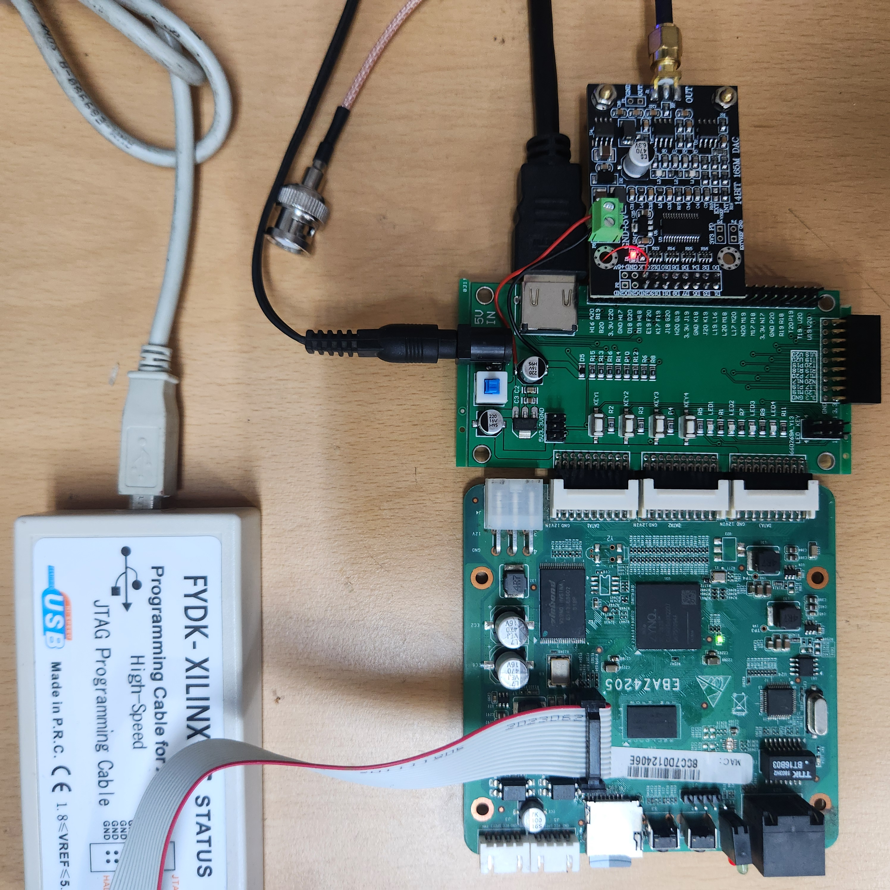
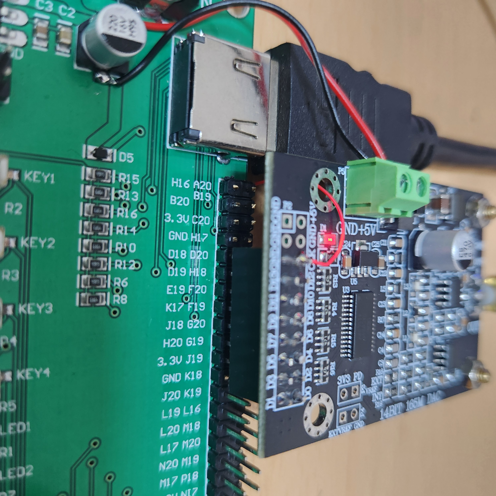

# NexEBAZ4205_DAC904_PS

EBAZ4205 + 660Z069A_V13 IO board + DAC904 (14BIT 165MSPS) → DDS 신호발생기 + HDMI 파형 표시

## 작업단계 - NexEBAZ4205_OV5640_PS 프로젝트를 clone 해서 이제 막 시작한 단계

## 실습 환경

| 위에서 | 옆에서 |
|--------|--------|
|  |  |

- EBAZ4205(하단) + 660Z069A_V13 IO 보드(중간) + DAC904(상단) 스택 구성
- JTAG-XILINX 케이블로 FPGA 프로그래밍, BNC 케이블로 아날로그 출력
- DAC904 5V: IO 보드 DC잭 근처 캐패시터 → DAC 터미널 블록 점프

## 빌드 및 실행

```bash
# 빌드
cd /media/douglas/extssd/FPGA/Xilinx/NexEBAZ4205_DAC904_PS
vivado -mode batch -source vivado/run_build.tcl
```

```
# 실행 (xsdb)
connect
targets 2
rst -processor
source .../vivado/project_1/dac904_ps.gen/sources_1/bd/design_1/ip/design_1_processing_system7_0_0/ps7_init.tcl
ps7_init
ps7_post_config
fpga -f .../vivado/project_1/dac904_ps.runs/impl_1/top_dac904_ps.bit
```

## Architecture

```
DDS → dac_data[13:0] → DAC904 → BNC 출력
    → AXI HP0 → DDR3 → AXI HP1 → 파형 렌더러 → HDMI
```

## DAC904 핀 연결

IO pos 5 = DAC pos 3 기준으로 장착. IO pos 1~4 헤더 핀 절단 (HDMI 충돌).

| DAC 신호 | FPGA 핀 | 연결 방식       |
|---------|---------|----------------|
| CLK     | D18     | 점퍼 (초단거리) |
| D0      | K18     | 직접           |
| D1      | T19     | 점퍼 (20핀)    |
| D2      | J19     | 직접           |
| D3      | V20     | 점퍼 (20핀)    |
| D4      | G19     | 직접           |
| D5      | H20     | 직접           |
| D6      | G20     | 직접           |
| D7      | J18     | 직접           |
| D8      | U19     | 점퍼 (20핀)    |
| D9      | K17     | 직접           |
| D10     | R18     | 점퍼 (20핀)    |
| D11     | E19     | 직접           |
| D12     | H18     | 직접           |
| D13     | P20     | 점퍼 (20핀)    |

## Status

- [x] 하드웨어 핀 연결 완료 (직접 9개 + 점퍼 6개)
- [x] XDC, top_dac904_ps.v 완료
- [ ] DDS Verilog 구현 (구형파/삼각파/사인파/톱니파)
- [ ] HDMI 파형 표시
